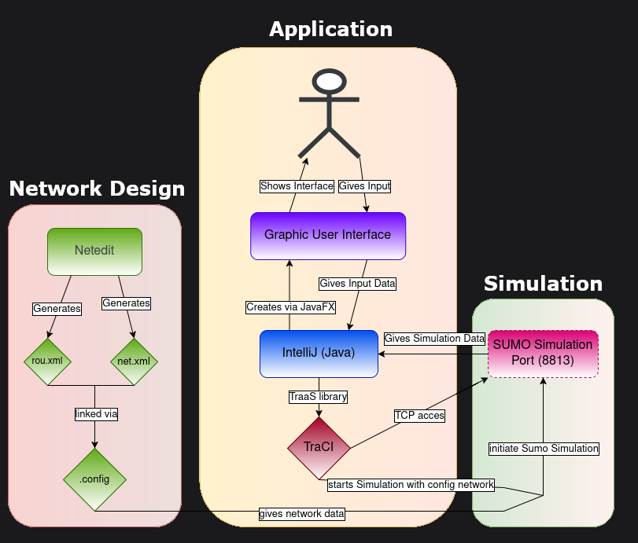
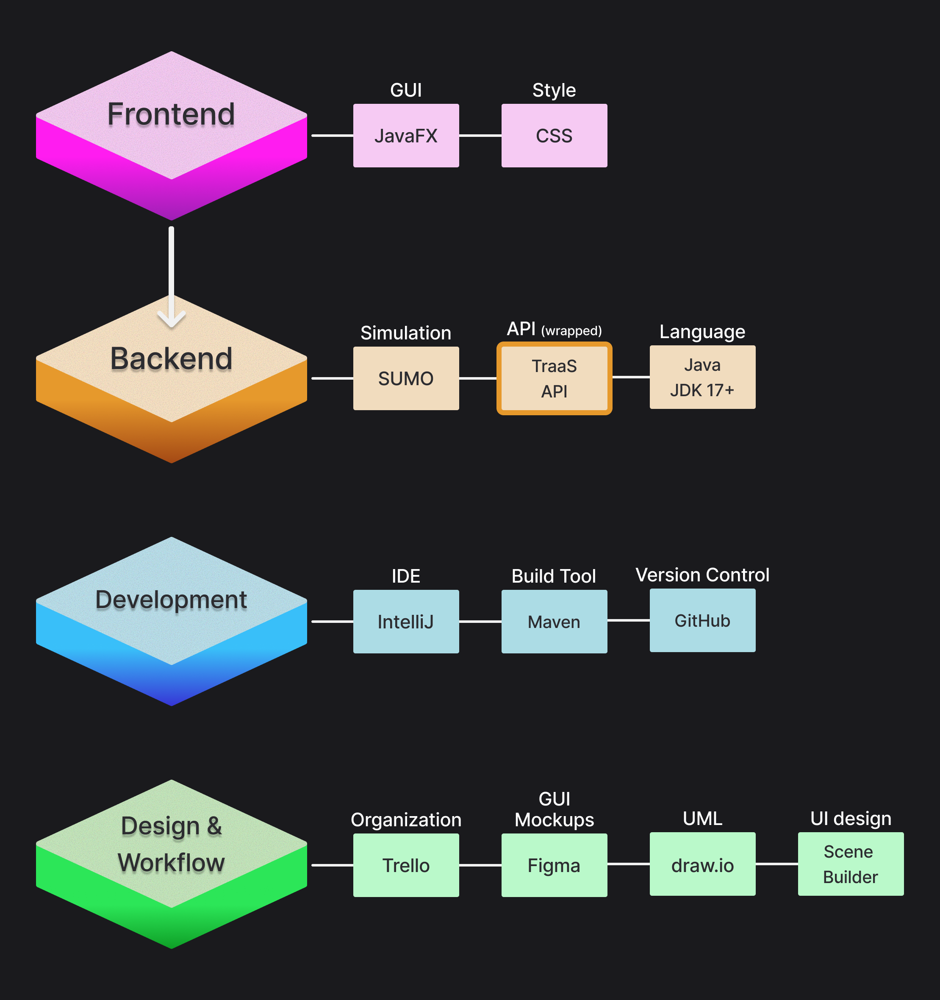

# ⭐ STAR ⭐ (**S**UMO **T**raffic **A**nalytics in **R**eal-time)

 
 


 


A real-timetraffic simulation platform controlling an instance of the **[SUMO](https://eclipse.dev/sumo/)** simulation package via the **TraaS API** over a localhost server.
<br>This application visualizes traffic flow, enables user interaction, and allows for adaptive traffic control strategies as well as statistical analysis of traffic.

Developed for the **Object-Oriented Programming in Java - Advanced Course** module (Winter 25/26) at **Frankfurt University of Applied Sciences**, project supervision by **Prof. Dr. Ghadi Mahmoudi**
<p align="center">
  
</p>

## Table of Content

- [Project Description](#project-description)
- [Features](#features)
- [Prerequisites](#prerequisites)
- [Running](#running)
- [Architecture & Technology Stack](#architecture--technology-stack)
- [Team Members](#team-members)

## Project Description

This project is a real-time traffic simulation platform developed in Java, designed to interface with the **SUMO** engine. <br>
By wrapping the **TraaS** API's functionalities, our application bridges the gap between simulation data and visualization / manipulation.

The TraaS API (native to SUMO) relies heavily on static methods and vague function calls. <br>
Our solution implements a robust Object-oriented wrapper around TraaS, encapsulating entities like Vehicles, Edges, and Traffic Lights into clean, reusable, instanceable objects to ensure maintainability and extensibility.

This software provides an environment for experimenting with traffic flow and urban mobility. <br>
Unlike the native sumo-gui, this platform offers a custom JavaFX GUI that allows users to interact with the simulation in real-time. <br>

### Features elevating our project from the native sumo-gui:

#### Live Control: <br> 
Users can inject vehicles, manipulate traffic light phases, and apply stress tests on the road network to observe and compare congestion behavior in real-time, as the simulation is running.

#### Data Visualization: <br>
The road network is rendered in the JavaFX GUI providing live visual feedback on traffic flow, vehicle states, and phase indicators.

#### Analytics: <br>
Metrics such as average speed, vehicle density, and average vehicle waiting time, are displayed live, as well as exported to CSV and PDF for detailed reports.

## Features
### Current Features
- 2 preinstalled maps, but also allowing for user imports
- Map Select
- Run an instance of sumo on localhost
- Render UI using JavaFX
- Inject vehicles, allowing for the following variables
  - 1 - 1000 vehicles
  - 1 out of 16,777,216 possible Colors
  - Selectable Vehicle Type
  - Selectable Route for the vehicle to take
- Traffic light manipulation
- Display vehicles and traffic light data in a Data Pane
- Filter vehicles by attributes (color, speed, route, type)
- Output Data to .csv as well as .pdf

## Prerequisites
- JDK 25+
- [SUMO 1.24](https://sourceforge.net/projects/sumo/files/sumo/version%201.24.0/sumo-win64extra-1.24.0.msi/download) (Windows 64 Extra version)

### Included Dependencies (included in pom.xml)
- TraaS 1.1
- jdom 2.0.6.1
## Running

##### 1. Clone the Repository
```bash
git clone https://github.com/LuarEbre/STAR.git STAR
```
##### 2. Run Main
- Open an IDE of your choosing (IntelliJ, Eclipse, VSCode)
- Run the class Main.java
##### 3. Windows Users only:
- Allow elevator.exe to bypass Windows Defender (only if using IntelliJ)
- Allow sumo to bypass the firewall (otherwise problems might occur when trying to run the server clientside)
## Architecture & Technology Stack
<p align="center">
    
</p>
<p align="center">
    
</p>

## Team Members
### · [Kevin Kornmann](https://github.com/sklettnov)
### · [Leandro Liuzzo](https://github.com/lelezss)
### · [Nico Buttgereit](https://github.com/toworlds)
### · [Raul Erbe](https://github.com/luarebre)
### · [Simon Reese](https://github.com/s-reese04)
