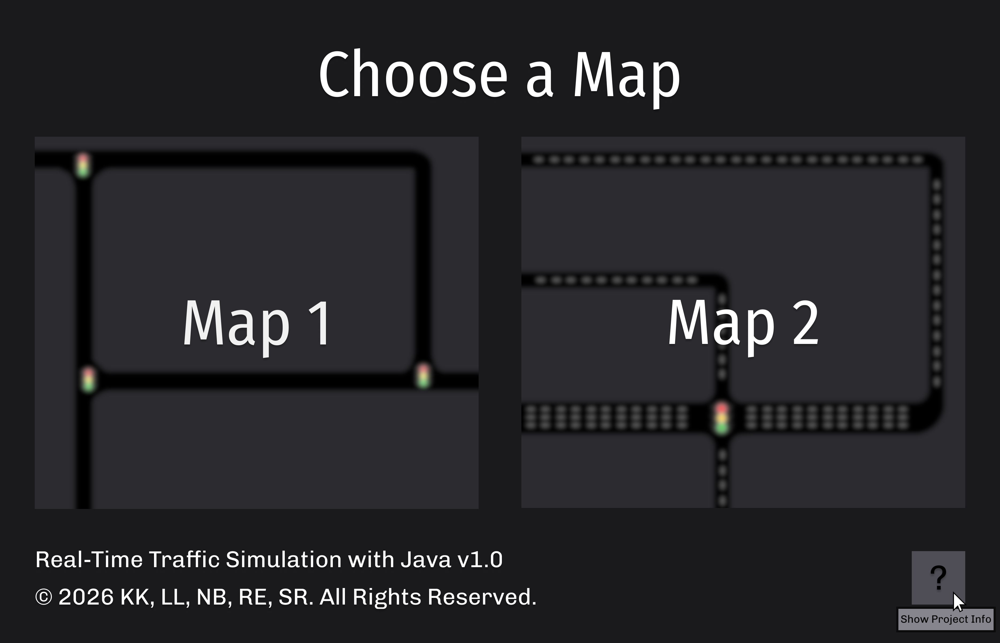
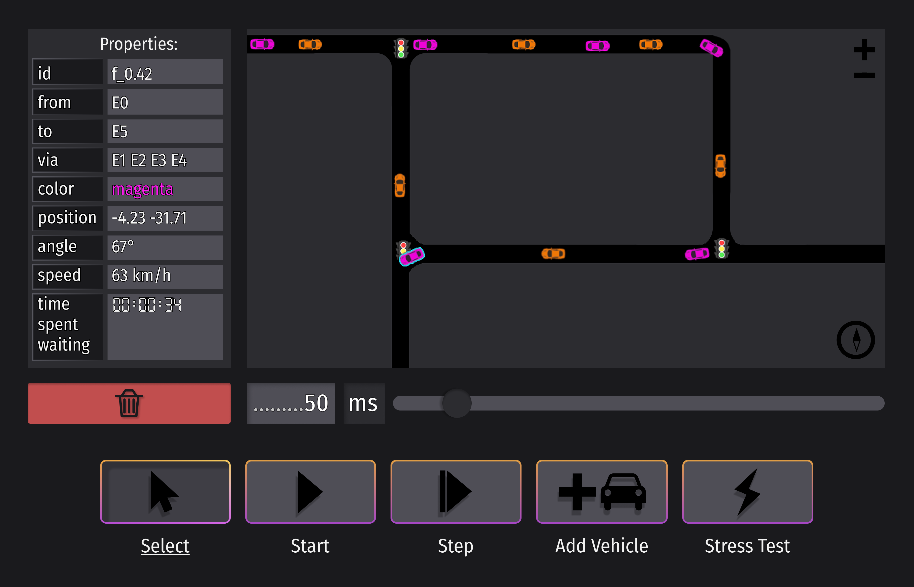
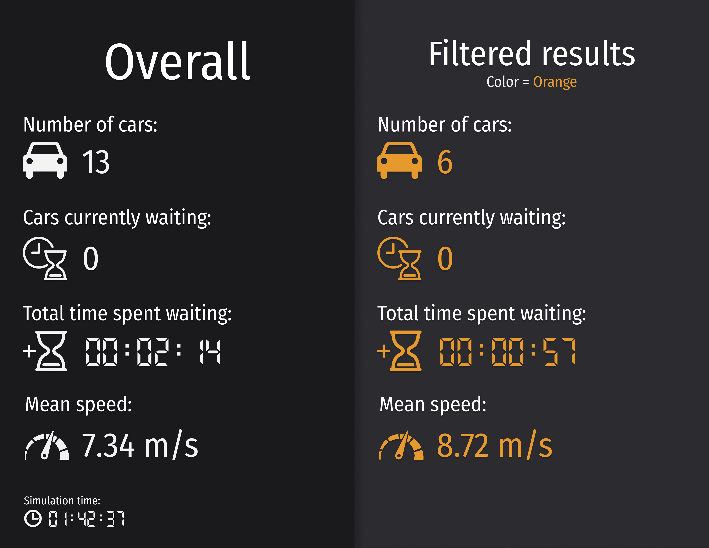

# Real-Time Traffic Simulation with Java

 
 


 


A real-time traffic simulation platform controlling an instance of **[SUMO](https://eclipse.dev/sumo/)** simulation package via the **TraaS API** over a localhost server.
<br>This application visualizes traffic flow, enables user interaction, and allows for adaptive traffic control strategies as well as statistical analysis of traffic.

Developed for the **Object-Oriented Programming in Java - Advanced Course** module (Winter 25/26) at **Frankfurt University of Applied Sciences**, project supervision by **Prof. Dr. Ghadi Mahmoudi**
<p align="center">
  
</p>

## Table of Content

- [Project Description](#project-description)
- [Features](#features)
- [Prerequisites](#prerequisites)
- [Running](#running)
- [Architecture](#architecture)
- [Team Members](#team-members)

## Project Description
>**Disclaimer**: *This list includes both implemented functionalities and features planned for future releases.*

This project is a real-time traffic simulation platform developed in Java, designed to interface with the **SUMO** engine. <br>
By wrapping the **TraaS** API's functionalities, our application bridges the gap between simulation data and visualization / manipulation.

The TraaS API (native to SUMO) relies heavily on static methods and vague function calls. <br>
Our solution implements a robust Object-oriented wrapper around TraaS, encapsulating entities like Vehicles, Edges, and Traffic Lights into clean, reusable, instanceable objects to ensure maintainability and extensibility.

This software provides an environment for experimenting with traffic flow and urban mobility. <br>
Unlike the native sumo-gui, this platform offers a custom JavaFX GUI that allows users to interact with the simulation in real-time. <br>

### Features elevating our project from the native sumo-gui:

#### Live Control: <br> 
Users can inject vehicles, manipulate traffic light phases, and apply stress tests to specific road edges to observe and compare congestion behavior.

#### Data Visualization: <br>
The road network is rendered in the JavaFX GUI providing live visual feedback on traffic flow, vehicle states, and phase indicators.

#### Analytics: <br>
Metrics such as average speed, vehicle density, and travel times, are displayed live, as well as exported to CSV and PDF for detailed reports.

## Features
### Current Features
- 1 simple, temporary map for test purposes
- Run an instance of sumo / sumo-gui (only used for visualisation until we develop our own GUI)
- Run simulation for 200 seconds / ticks
- Inject vehicles into a pre-determined route (from .rou.xml file)
- Print out specific cars attributes (velocity, position, angle, etc.)
- Cleanly close simulation
---
### Future Features
- 2 fleshed out maps – 1 very detailed, 1 a bit simpler
- Run only sumo, visualisation now being rendered in a JavaFX GUI
- Full wrapper classes for all classes essential to project scope

- Map Select
  <p align="center">
    
  </p>
* Simulation Dashboard
    * Inject Vehicle button
    * Stop / Start button
    * Single step button
    * Select mode button
    * Stress test mode button
  * Rendered map based on telemetry data of vehicles 
    * Allows for zooming, panning, and camera rotation
  * Statistical output of selected elements (vehicle / traffic light)
  <p align="center">
    
  </p>
- Traffic light manipulation
- Filter vehicles by attributes (color, speed, route, etc.)
- Live statistical analysis as well as output as .csv
  <p align="center">
    
  </p>
## Prerequisites
- JDK 17+
- [SUMO 1.24](https://sourceforge.net/projects/sumo/files/sumo/version%201.24.0/sumo-win64extra-1.24.0.msi/download) (Windows 64 Extra version)

### Included Dependencies (included in pom.xml)
- TraaS 1.1
- jdom 2.0.6.1
## Running

##### 1. Clone the Repository
```bash
git clone https://github.com/LuarEbre/Real-Time-Traffic-Simulation-with-Java.git Real-Time-Traffic-Simulation-with-Java
```
##### 2. Run Main
- Open an IDE of your choosing (IntelliJ, Eclipse, VSCode)
- Run the class Main.java (contains public static void main(String[] args))
##### 3. Windows Users only:
- Allow elevator.exe to bypass Windows Defender (only if using IntelliJ)
- Allow sumo to bypass the firewall (otherwise problems might occur when trying to run the server clientside)
## Architecture & Technology Stack
<p align="center">
    
</p>
<p align="center">
    
</p>

## Team Members
### · [Kevin Kornmann](https://github.com/sklettnov)
### · [Leandro Liuzzo](https://github.com/lelezss)
### · [Nico Buttgereit](https://github.com/toworlds)
### · [Raul Erbe](https://github.com/luarebre)
### · [Simon Reese](https://github.com/s-reese04)